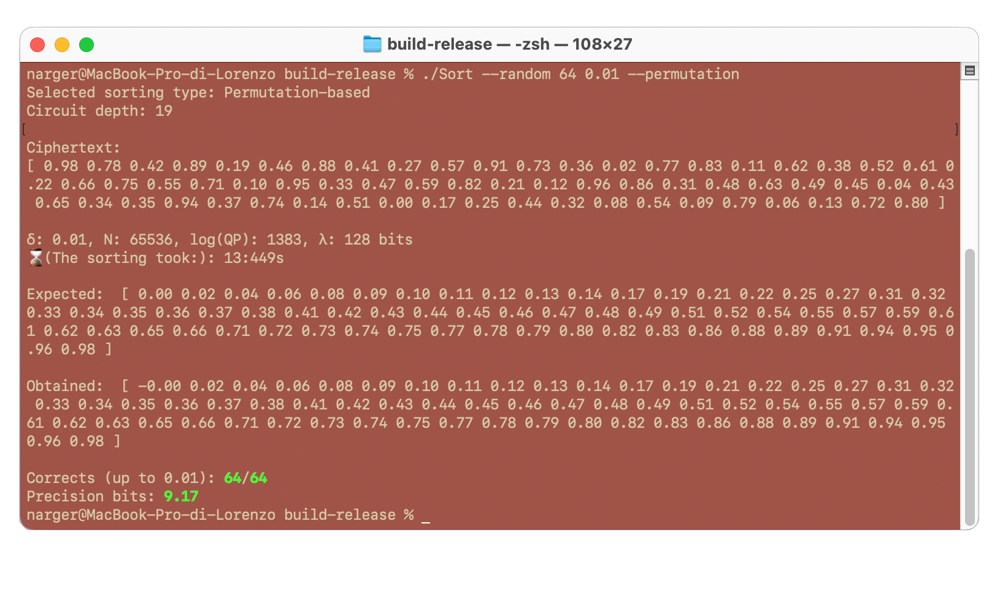

# Lightweight Sorting in Approximate Homomorphic Encryption


[](https://github.com/lorenzorovida/Lightweight-Sorting-In-Approximate-Homomorphic-Encryption/actions/workflows/cmake-single-platform.yml)
<br>
<a href="https://eprint.iacr.org/2025/1150"></a>


---
This repository contains the source code for the preprint paper *[Lightweight Sorting in Approximate Homomorphic Encryption](https://ia.cr/2025/1150)*. With this code it is possible to sort a vector of encrypted values in "reasonable" time (e.g., few seconds for 128 elements in $[0, 1]$, with precision up to $10^{-2}$).

The proposal (and the code) is split in two parts:
- We propose a concrete improvement in terms of runtime and memory from [MEHP25], although we use precisely the same framework.
- We propose an implementation of a bitonic sorting network based on compare-and-swap operations approximated with the ReLU function

Both algorithms have been implemented in the [OpenFHE](https://eprint.iacr.org/2022/915) implementation of the [RNS-CKKS scheme](https://eprint.iacr.org/2020/1118)


## Requirements
It is pretty straightforward to use this source code, first of all **be sure** that all requirements are satisfied.

- cmake
- [OpenFHE](https://github.com/openfheorg/openfhe-development)

## How to use it

First of all clone the repository:

```
git clone https://github.com/lorenzorovida/Lightweight-Sorting-In-Approximate-Homomorphic-Encryption
```

Then, make a `build` folder and build the project with `cmake`
```
mkdir build
cd build
cmake ..
make -j
```
A sample usage to test if everything is setup might be:
```
./Sort --random 16 --delta 0.01 --toy --permutation
```
That sort 16 random elements using permutation-based approach, with toy parameters.

Now it is possible to launch the program! Notice that, before doing that, some arguments are mandatory

### Required arguments:
In order to work properly, we must define some required arguments:

#### Input values:
One of the following three arguments are required in order to correctly give the input to the circuit.

- **Random**: To use as input a vector of values from 0 to `n` randomly shuffled, use `--random n` where `n` is a power of two. Also, set the delta value `--delta d` where `d` represents the $\delta$ term used in the paper. For example:
```
--random 8 --delta 0.01
```

- **Input file**: To use as input a file, use `--file FILENAME` where `FILENAME` is the selected file. Notice that the file must contain a power-of-two number of values. For example:
```
 --file "../inputs/sample.txt" --delta 0.01
```

- **Input inline**: Alternatively, you can provide a vector directly by enclosing it in square brackets, for example: `"[0.5, 0.12, 0.71, 0.42]"`. Notice that, also in this case, the length of the vector $|v|$ must be a power of two. 
```
--inline "[0.5, 0.12, 0.71, 0.42]" --delta 0.01
```

#### Sorting method
Moreover, you have to pick the sorting algorithm, that can be either the permutation-based (light and fast, requires $\Theta(n^2$ slots) or the network-based (heavier and requires bootstrapping, but uses $\Theta(n)$ slots).

- **Permutation-based**: simply use:
```
--permutation
```
- **Network-based**: simply use:
```
--network
```

As an example, if we want to sort 64 random values at maximum distance 0.001 with permutation-based, we can execute:
```
./Sort --random 64 --delta 0.001 --permutation
```

### Optional arguments:
*Be sure to check the paper in order to fully understand the impact of each argument*!

It is possible to change the behavior of the program by using some optional argument:

- `--tieoffset`: use this argument in the permutation-based approach if the inputs contain repeated elements.
```
./Sort --random 32 --delta 0.1 --permutation --tieoffset --toy
```
> [!IMPORTANT]
> If the input contains repeated elements and this flag is not on, sorting will not work properly.

- `--toy`: with this argument the cryptosystem will not have the minimum requirement of $\lambda \geq 128$ security bits against classical computers, but will be much faster and lighter. Suggested in case you want to play around with the algorithm. For example:
```
./Sort --random 32 --delta 0.01 --permutation --toy
```

- `--verbose`: prints some (hopefully) useful stuff. For example:
```
./Sort --random 32 --delta 0.01 --toy --network --verbose
```

## Suggestions

As this work is still partially WIP, Feel free to open issues or to send us messages with suggestions/comments/critics! 

## Presentation

You can find a presentation of this work clicking here:

[](https://www.youtube.com/watch?v=ea066flbddU)

## Authors

- Lorenzo Rovida (`lorenzo.rovida@unimib.it`)
- Alberto Leporati (`alberto.leporati@unimib.it`)
- Simone Basile (`s.basile@campus.unimib.it`)

Made with <3  at [Bicocca Security Lab](https://www.bislab.unimib.it), at University of Milan-Bicocca.


### Declaration

This is a proof of concept and, even though parameters are created with $\lambda \geq 128$ security bits (according to [Homomorphic Encryption Standards](https://homomorphicencryption.org/standard)), this circuit is intended for educational purposes only.


## References

[MEHP25] Federico Mazzone, Maarten Everts, Florian Hahn and Andreas Peter, *Efficient Ranking, Order Statistics, and Sorting under CKKS* in: USENIX Security '25
